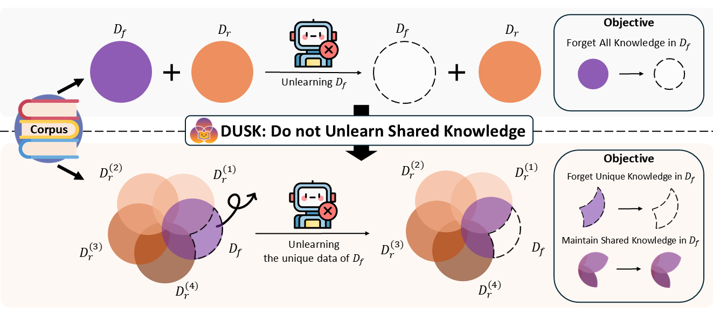

#  DUSK: Do Not Unlearn Shared Knowledge
This repository is the official implementation for the paper: **DUSK: Do Not Unlearn Shared Knowledge**


<p align="center">
  <a href="https://ai-isl.github.io/"> 🏠 Homepage</a> |
  <a href="https://ai-isl.github.io/"> 📜 Paper</a> | 
  <a href="https://huggingface.co/datasets/AI-ISL/DUSK"> 🤗 Dataset</a>
</p>


## Introduction

DUSK is a benchmark for evaluating machine unlearning in realistic multi-source settings, where the same information can appear across both forget and retain sets. Unlike prior evaluations that assume clean disjoint splits, our DUSK dataset **overlap through paired documents with shared and unique content**. We provide fine-grained metrics to assess whether unlearning methods can precisely remove forget-specific knowledge while preserving shared and retained information. Our experiments show that existing methods often over-forget, failing to preserve critical knowledge. DUSK highlights the challenges of selective unlearning and supports future work on reliable data removal.


## Installation

```shell
conda create -n dusk python=3.10
conda activate dusk
conda install pytorch pytorch-cuda=11.8 -c pytorch -c nvidia
conda install -c "nvidia/label/cuda-11.8.0" cuda-toolkit
pip install -r requirements.txt
pip install flash-attn --no-build-isolation
```

### For Downstream Task
```shell
git clone --depth 1 https://github.com/EleutherAI/lm-evaluation-harness
cd lm-evaluation-harness
pip install -e .
```


> *All experiments are conducted on two NVIDIA L40S GPUs with 32GB of memory.*

## Unlearning Finetuned Model and Evaluation

### Unlearning Assessment Tasks:
After unlearning the target model, the model will be subsequently evaluated.

```shell
bash scripts/baselines.sh
```

**Available unlearning methods**
> NONE+GD, GA, GA+GD, GA+KL, NPO, NPO+GD, NPO+KL, RMU, TV, SGA (for TAU)


* If you want to use **TAU** method, you should firstly unlearn model by using SGA and then run `scripts/baselines_TAU.sh`.


### Downstream Tasks:
Evaluate general capability after unlearning using a range of downstream tasks.
```shell
bash scripts/downstream.sh
```

## Acknowledgments

This repository builds upon the codebase of the [Closer-look-LLM-unlearning](https://github.com/sail-sg/closer-look-llm-unlearning). We appreciate their valuable and inspiring work.
